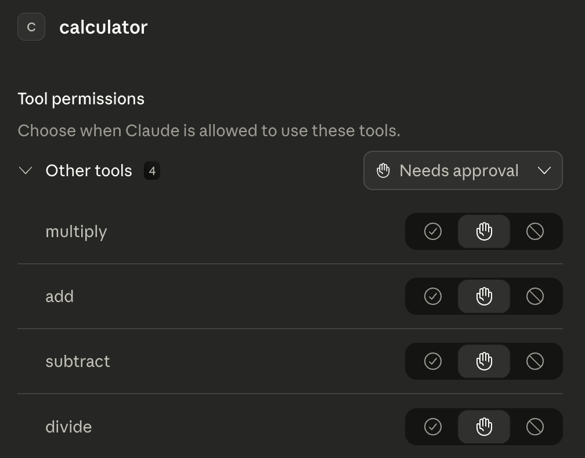

# MCP Demo

This is a demo of the MCP (Model Context Protocol) for testing and demonstration purposes. It includes a simple implementation of the MCP protocol and a sample calculator MCP server that can be used to test the protocol.

## Running the Demo
```bash
npm install @modelcontextprotocol/sdk zod
node demo-client.mjs
```

And output should be:

```
✅ Calculator MCP server running on stdio
🔢 Calculator MCP Demo
───────────────────────────────────

📋 Available tools: multiply, add, subtract, divide

  7 × 6 = 42
  123 × 456 = 56088
  42 + 58 = 100
  100 − 37 = 63
  144 ÷ 12 = 12
  Error: Division by zero is undefined.

✅ Demo complete!
```

## How It Works
There are two files:

**`server.mjs` — the MCP Server**
- Registers 4 tools: `multiply`, `add`, `subtract`, `divide`
- Each tool has a name, description, and typed inputs (using Zod)
- Listens for calls over stdio (stdin/stdout)

**`demo-client.mjs` — the MCP Client**
- Spawns `server.mjs` as a subprocess
- Calls `listTools()` to discover what the server offers
- Calls each tool with arguments, gets results back

The communication between them looks like this:

```
demo-client.mjs  ──── JSON-RPC over stdio ────▶  server.mjs
   (Client)             { tool: "multiply",         (Server)
                          args: { a:7, b:6 } }
                ◀────────────────────────────────
                         { result: "7 × 6 = 42" }
```

## Connect to Claude Desktop

This lets Claude itself call your calculator tools in conversation.

Find your Claude Desktop config file:

Mac: `~/Library/Application Support/Claude/claude_desktop_config.json`
Windows: `%APPDATA%\Claude\claude_desktop_config.json`

See https://modelcontextprotocol.io/docs/develop/connect-local-servers for details.

Add this (replace the path with your actual folder path):
```json
{
  "mcpServers": {
    "calculator": {
      "command": "node",
      "args": ["/Users/yourname/calculator-mcp/server.mjs"]
    }
  }
}
```

Restart Claude Desktop. Then try asking Claude: "What is 123 multiplied by 456?" — it will use your multiply tool to answer.


